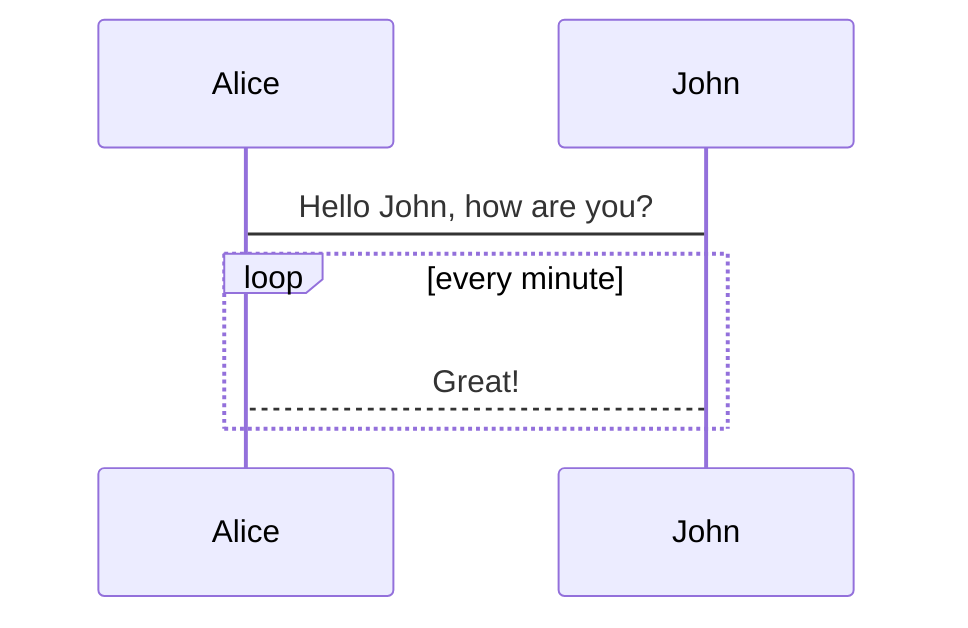

### 总控台介绍

总控台展示了管理的项目和应用以及设备相关信息，更加直观的

@flowstart
para=>parallel: parallel tasks
process=>operation: Process
e=>end: End

para(path1, bottom)->process->e
para(path2)->e
@flowend




```javascript
alert('1')
```